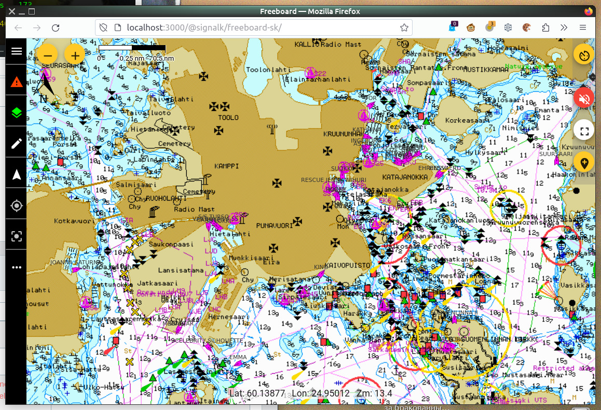
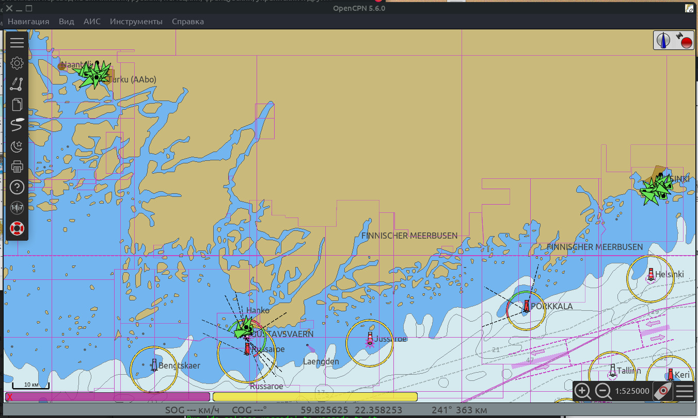

# inetAIS daemon 
Broadcast to LAN of the AIS messages from [digitraffic.fi](https://www.digitraffic.fi/en/marine-traffic/ais/) as NMEA 0183 AIS flow. For demo and tests purposes.

version 0.

## Features
- Broadcast of AIS targets for one or more user defined points.
- Broadcast of all known digitraffic.fi AIS targets.

## Compatibility
Any device/software capable of receiving NMEA 0183 messages via LAN.  

For example, the [gpsd](https://gpsd.io/)-based software charftplotter:  
  

Or [SignalK](https://signalk.org/)-based software charftplotter:  
  

Or OpenCPN:  
  

## Requirements
Linux, PHP 7.

## Install & Configure
1) Copy project to any dir by `git clone`, copy and unzip from GitHub or by any way.  
2) Edit *params.php*

## Usage
Start daemon by  
`php inetAIS.php`  
or  
`./start`  
or  
`./start -d`  
for daemonise.  

Configure your device/software to receive NMEA 0183 from host (may be localhost?) and port (3800 by default) as you set in *params.php*. 

## Support
[Forum](https://github.com/VladimirKalachikhin/Galadriel-map/discussions)

The forum will be more lively if you make a donation at [ЮMoney](https://sobe.ru/na/galadrielmap)

[Paid personal consulting](https://kwork.ru/it-support/20093939/galadrielmap-installation-configuration-and-usage-consulting)  
