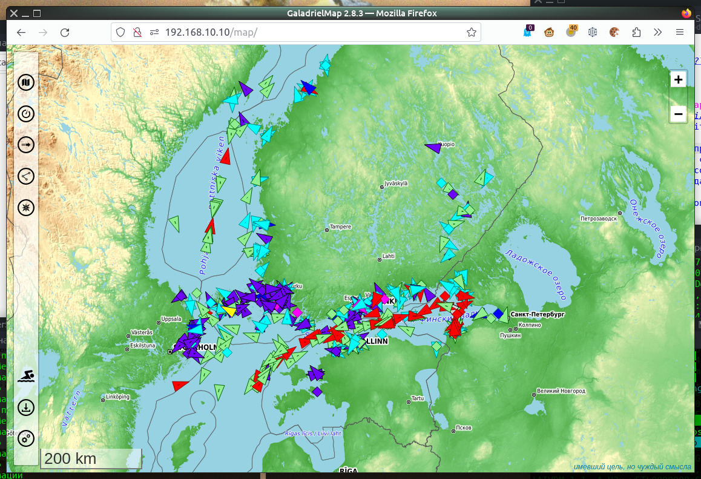
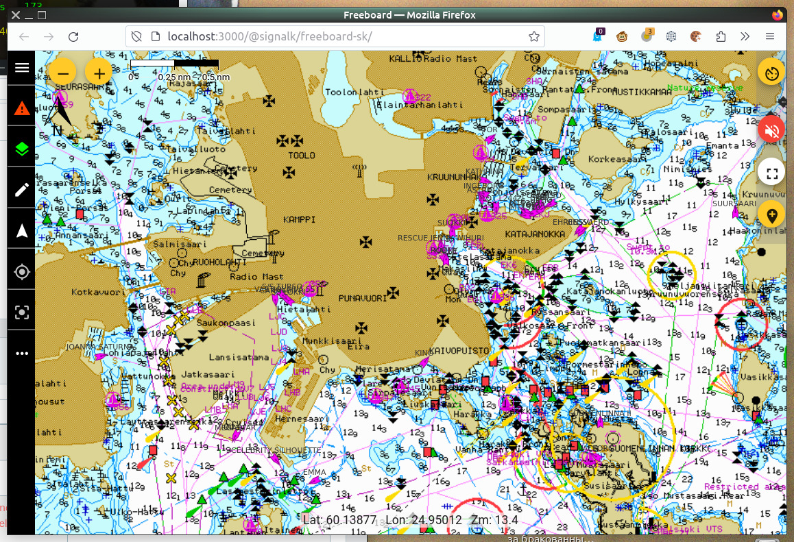
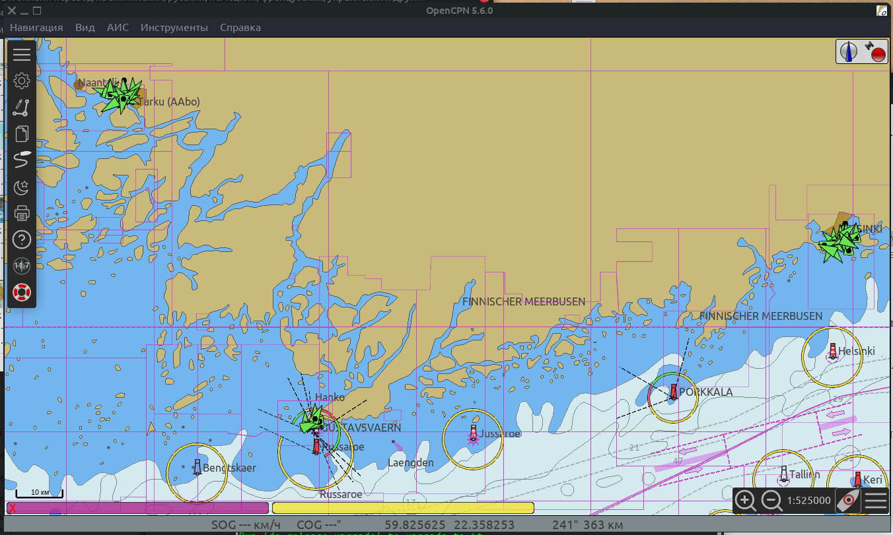
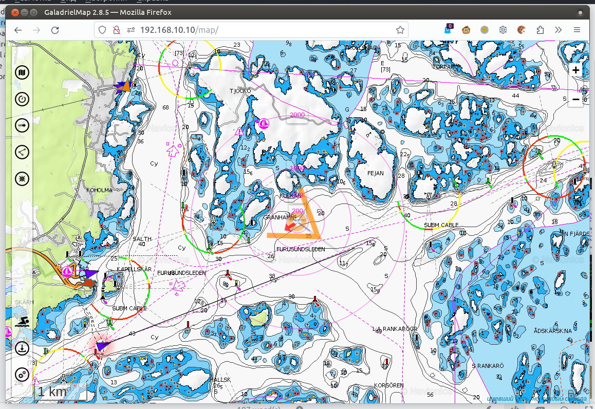

# inetAIS daemon 

Трансляция данных AIS с [digitraffic.fi](https://www.digitraffic.fi/en/marine-traffic/ais/) в виде потока сообщений NMEA0183 AIS в локальной сети.  
В основном для тестовых и демонстрационных целей.

Настоятельно не рекомендуется использовать приложение на судне вместо настоящего приёмника AIS. В первую очередь из-за [декларируемых ограничений сервиса](https://www.digitraffic.fi/en/marine-traffic/ais/), во вторую -- из-за существенной задержки появления изменений состояния целей: не менее минуты.

версия 0.

## Возможности
- Трансляция целей AIS, находящихся в одной или нескольких указанных пользователем точках
- Трансляция всех известных digitraffic.fi целей AIS.
- Трансляция целей AIS, находящихся в текущей позиции. Текущая позиция может быть получена от [gpsd](https://gpsd.io/), [gpsdPROXY](https://hub.mos.ru/v.kalachihin/gpsdPROXY) или от [SignalK](https://signalk.org/).
- Передача данных напрямую в [gpsdPROXY](https://github.com/VladimirKalachikhin/gpsdPROXY).

## Совместимость
Приложение может быть использовано с любым устройством или программным обеспечением, способным получать поток NMEA0183 по локальной сети.  
Например, это может быть программный картплотер (электронно-картографическая система), основанный на [gpsd](https://hub.mos.ru/v.kalachihin/GaladrielMap):  
  
Или программный картплотер, основанный на [SignalK](https://signalk.org/):  
  
Или [OpenCPN](https://opencpn.org/):  
  

Совместно с данными от [gpsdPROXY](https://hub.mos.ru/v.kalachihin/gpsdPROXY):  

## Требования
Linux, PHP 7.

## Установка и конфигурирование
1) Скопируйте файлы проекта в любое место на сервере путём `git clone` или любым другим способом.
2) Отредактируйте файл *params.php*

## Использование
Запустите демон командой  
`php inetAIS.php`  
или командой  
`./start`  
или командой  
`./start -d`  
в фоновом режиме.

Сконфигурируйте ваше устройство / приложение для  получения потока NMEA0183 с адреса и порта, указанных в *params.php* (по умолчанию - localhost:3800)  
Не нужно делать дополнительных настроек для получения данных в [gpsdPROXY](https://github.com/VladimirKalachikhin/gpsdPROXY).

## Поддержка
[Сообщество ВКонтакте](https://vk.com/club212992298)

[Платные персональные консультации](https://kwork.ru/it-support/20093939/galadrielmap-installation-configuration-and-usage-consulting)
